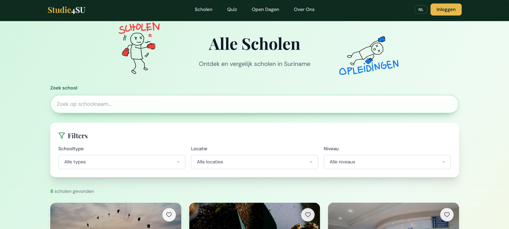
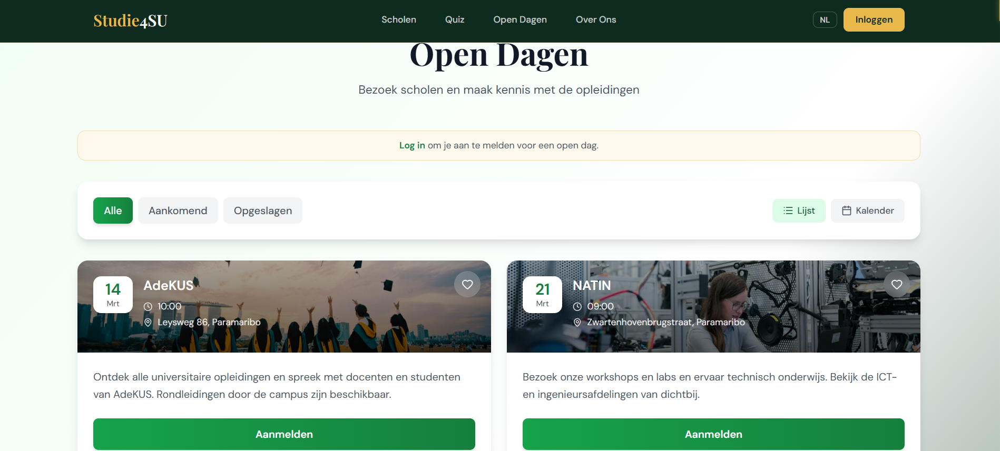
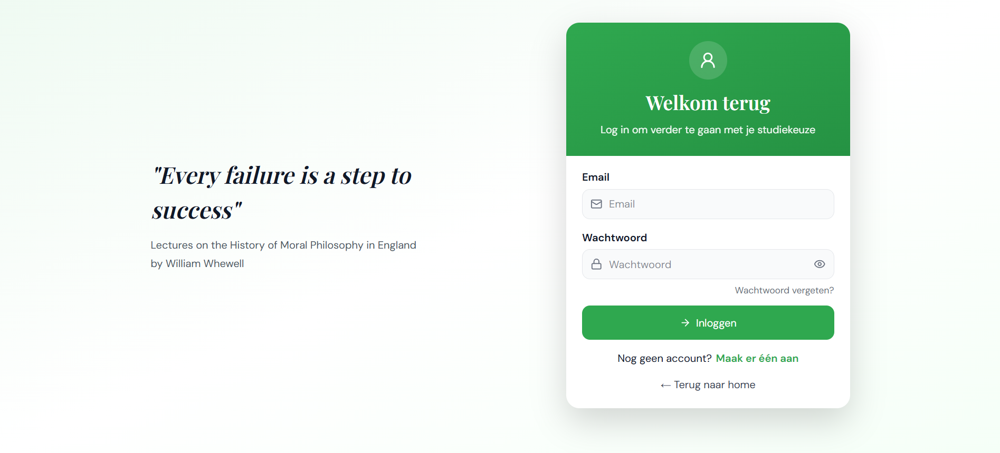

Welkom bij **Studie4SU**! Het platform dat speciaal is ontworpen om studenten in Suriname te helpen bij het maken van een van de belangrijkste keuzes in hun leven: de juiste vervolgopleiding vinden. 

Of je nu al precies weet wat je wilt of nog compleet in het duister bent, dit platform begeleidt je stap voor stap. In deze handleiding leggen we je uit hoe je de belangrijkste functies van ons platform gebruikt.

---

## 1. Scholen en Studieprogramma's Ontdekken
Op onze overzichtspagina vind je een compleet aanbod van de beschikbare scholen en hun opleidingen. 

* **Zoeken:** Gebruik de zoekbalk bovenaan om direct te zoeken op een specifieke richting (bijvoorbeeld "ICT" of "Economie").
* **Filteren:** Je kunt de resultaten filteren op niveau, locatie of type opleiding om precies te vinden wat bij jouw profiel past.
* **Details bekijken:** Klik op een opleiding om alle belangrijke informatie te lezen, zoals de toelatingseisen, de vakken en de toekomstmogelijkheden.

> 📸 **[PLAATS HIER EEN SCREENSHOT VAN DE OPLEIDINGEN-OVERZICHTSPAGINA]**

---

## 2. De interactieve Studie-Keuze Quiz
Weet je nog niet zeker welke richting het beste bij je past? Geen probleem! Onze interactieve quiz helpt je op weg.

1. Ga in het hoofdmenu naar **Doe de Quiz**.
2. Beantwoord een reeks korte, leuke vragen over jouw interesses, sterke punten en wat je belangrijk vindt in je toekomstige werk.
3. Aan het einde analyseert ons systeem jouw antwoorden en krijg je direct een gepersonaliseerde top 3 van opleidingen die perfect bij jouw persoonlijkheid passen.

> 📸 **[PLAATS HIER EEN SCREENSHOT VAN DE STUDIE-KEUZE QUIZ RESULTATEN]**
> 

---

## 3. Virtuele Open Dagen Bijwonen
Je hoeft de deur niet meer uit om de sfeer van een school te proeven. Via Studie4SU kun je je direct inschrijven voor Virtuele Open Dagen.

* **Agenda:** Bekijk de kalender voor aankomende evenementen.
* **Registreren:** Maak een account aan en meld je met één druk op de knop aan voor een virtuele sessie.
* **Herinneringen:** Je krijgt vanzelf een melding wanneer de open dag bijna begint.

> 📸 **[PLAATS HIER EEN SCREENSHOT VAN DE VIRTUELE OPEN DAGEN KALENDER]**
> `

---

## 4. Jouw Persoonlijke Account
Om het maximale uit Studie4SU te halen, raden we je aan om een gratis account aan te maken. 

**Met een account kun je:**
* Jouw favoriete opleidingen opslaan om ze later makkelijk terug te vinden.
* De uitslagen van je Studie-Keuze Quiz bewaren.
* Je aanmelden voor evenementen en open dagen.

Klik rechtsboven op **Inloggen / Registreren** om direct te beginnen!

> 📸 **[PLAATS HIER EEN SCREENSHOT VAN HET INLOG/REGISTRATIESCHERM]**
> `

---

**Heb je na het lezen van deze handleiding nog vragen?** 
Neem dan gerust contact op met het Studie4SU team via onze contactpagina. Heel veel succes met het vinden van jouw droomstudie!